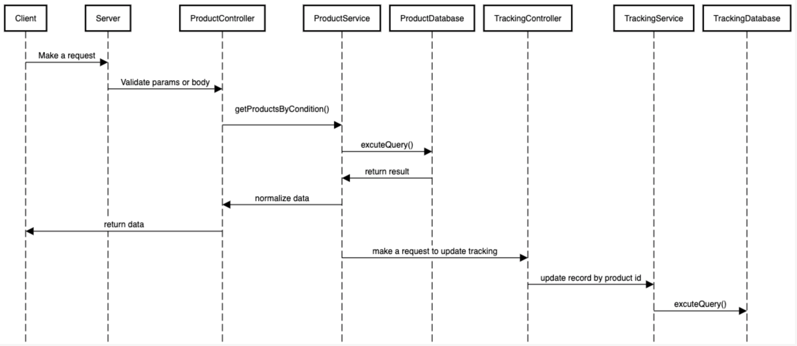

# Sequence Diagram

# Entity relationship diagram (using NoSQL)

# Code folder structure and the libraries / frameworks being used.

- Frameworks and libraries:
  - NestJS
  - OpenAPI (aka Swagger)
  - Mongoose
  - ...

# Run on local computer

- npm i lerna -g
- lerna bootstrap
- yarn start

curl -X 'POST' \
  'http://localhost:3001/products/search' \
  -H 'accept: application/json' \
  -H 'Content-Type: application/json' \
  -d '{
  "sort": {
    "name": 0,
    "price": 0,
    "brand": 0,
    "color": 0
  },
  "search": {
    "color": [
      "red"
    ]
  },
  "limit": 10,
  "skip": 0
}'

## For easier, click this [link](http://localhost:3001/docs/#/Products/ProductsController_findAll) to see the request as well as response data.
